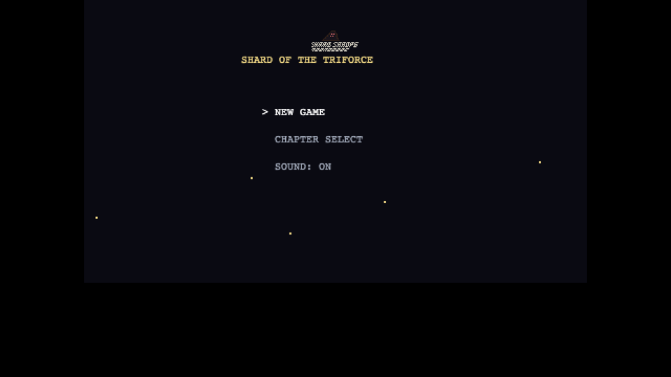
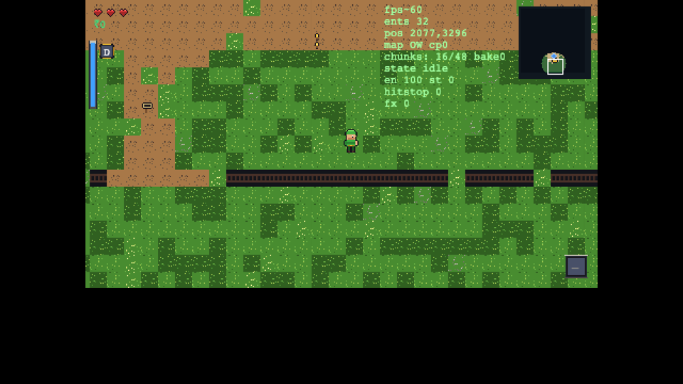

# Shard of the Triforce

A browser Zelda-like action-adventure built in Rust → WASM with a custom Canvas2D
engine and handcrafted programmatic pixel art. Act 1 is a full loop: overworld
exploration, gem quests, the Triforce Shrine dungeon, Gale Boomerang puzzles, and
the Granite Warden boss fight — wrapped in title/chapter/pause shells with
keyboard, gamepad, and touch controls.



**Play now:** [https://zelda-fable-5-high-and-grok-4-5-high.netlify.app](https://zelda-fable-5-high-and-grok-4-5-high.netlify.app)



## Controls

| Action | Keyboard | Gamepad | Touch |
|---|---|---|---|
| Move | WASD / Arrows | Left stick / D-pad | Left virtual stick |
| Attack | J | A / Cross | Attack disc |
| Item (tap) / Shield (hold) | K | X / Square | Item disc |
| Dash | L / Shift | B / Circle | Dash disc |
| Interact | E / Space | Y / Triangle | Interact disc |
| Cycle item | Q | LB / RB | Cycle disc |
| Pause | Esc / Enter | Start | Pause disc |
| Confirm / Skip credits | R / Enter | Back / Select | Tap menu row |
| Minimap | M | — | — |
| Debug overlay | F1 | — | — |

## Act 1 content

- **Overworld** — village, grove chime gates, raider camp war-chest, ruins plates,
  cliffs, shrine approach; soft critical path of three gems → sealed shrine.
- **Kit** — sword combo / charge spin / sword beam, dash i-frames, shield +
  perfect block, bombs, Gale Boomerang.
- **Dungeon** — room slides, keys/doors, crystal/flame/seal curriculum,
  Ironshell duo, Granite Warden (3 phases).
- **Meta** — title, chapter select, pause Map/Help/Options, mute, credits,
  continue-safe SaveGame v2.

## Run / build / deploy

```bash
rustup target add wasm32-unknown-unknown
cargo install trunk --locked

# Dev (do not ship trunk serve output)
trunk serve

# Release static site → dist/
env -u NO_COLOR trunk build --release

# Checks
cargo check --workspace --target wasm32-unknown-unknown
cargo clippy --workspace --target wasm32-unknown-unknown -- -D warnings

# Deploy (locked Netlify slug)
netlify deploy --prod --dir dist
```

If `NO_COLOR=1` is set in your environment, unset it for Trunk
(`env -u NO_COLOR trunk …`).

## Architecture

See [`docs/`](docs/):

- [`DECISIONS.md`](docs/DECISIONS.md) — locked stack / art / audio / input / save / deploy
- [`ARCHITECTURE.md`](docs/ARCHITECTURE.md) — crates, render, entities, ownership
- [`GAME_DESIGN.md`](docs/GAME_DESIGN.md) — combat, overworld, dungeon, boss
- [`PHASE_PLAN.md`](docs/PHASE_PLAN.md) — phases 0–5 acceptance

Crates: `engine` (platform), `content` (data-as-code), `game` (systems), `app` (WASM glue).

## Known issues / owed

- **Gamepad hardware** — code path + Help echo reviewed; physical pad not available
  in the build environment.
- **Real iPhone Safari** — Playwright iPhone 14 landscape used; on-device Safari
  pass still owed.
- Full New-Game→Warden human feel pass recommended beyond automated smoke
  (`/tmp/p5_validation/`).
- NPC/prop art remains readable stub quality, not final Minish Cap polish.
